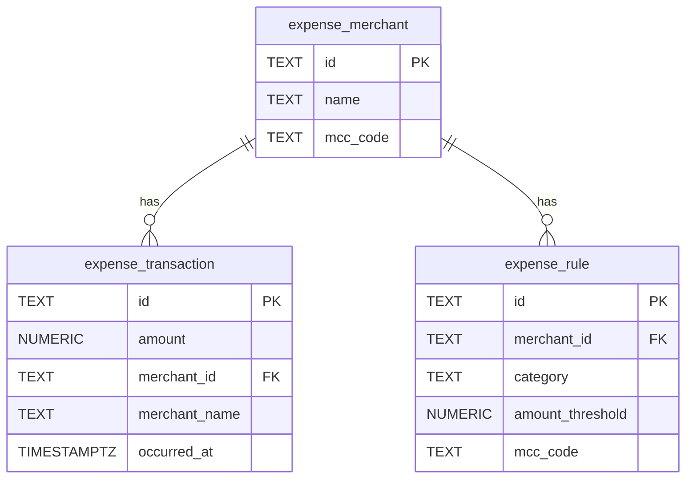

# Database Schema

```mermaid
erDiagram
    expense_merchant {
        TEXT id PK
        TEXT name
        TEXT mcc_code
    }

    expense_transaction {
        TEXT id PK
        NUMERIC amount
        TEXT merchant_id FK
        TEXT merchant_name
        TIMESTAMPTZ occurred_at
    }

    expense_rule {
        TEXT id PK
        TEXT merchant_id FK
        TEXT category
        NUMERIC amount_threshold
        TEXT mcc_code
    }

    expense_merchant ||--o{ expense_transaction : "has"
    expense_merchant ||--o{ expense_rule : "has"
``` 
