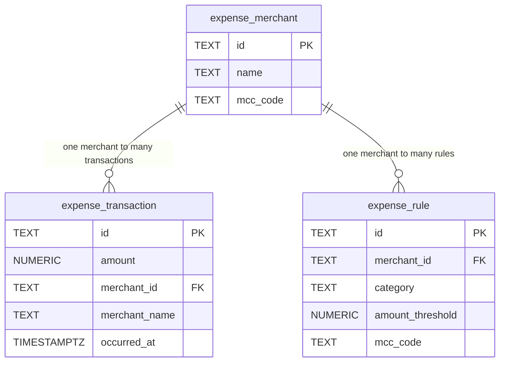

# Database Schema


## Schema decisions

**expense.merchant** — models the known merchants your Week 1 `MerchantNameClassifier` and `MccCodeClassifier` matched against. The `mcc_code` is nullable because not every merchant has one. No foreign keys on this table since it is the root of the hierarchy.

**expense.rule** — encodes the classification rules your Week 1 strategies used in code. `ON DELETE RESTRICT` on the merchant foreign key prevents orphaned rules — if a merchant is deleted, its rules must be removed first.

**expense.transaction** — stores individual transactions referencing a merchant, mapping directly to your Week 1 `Transaction` record. `ON DELETE CASCADE` on the merchant foreign key means if a merchant is removed, all its transactions go with it, since a transaction without a merchant has no meaning.

## Local run

```sql
psql postgres -c "DROP SCHEMA IF EXISTS expense CASCADE;"
psql postgres -f db/V1__schema.sql
psql postgres -f db/V2__seed.sql
psql postgres -f db/verify.sql
```

## Trade-offs

**TEXT ids vs SERIAL/BIGINT** — we chose `TEXT` ids (e.g. `txn-2026-0001`) over auto-incrementing integers because they are stable across environments, can carry semantic meaning, and match the string ids used in the Week 1 Java domain model. The trade-off is slightly larger storage and no guaranteed ordering by insertion time.

**ON DELETE CASCADE vs RESTRICT** — transactions use `CASCADE` because they are owned by the merchant and have no meaning without one. Rules use `RESTRICT` because a rule being orphaned is likely a mistake that should be caught explicitly, not silently deleted. 
